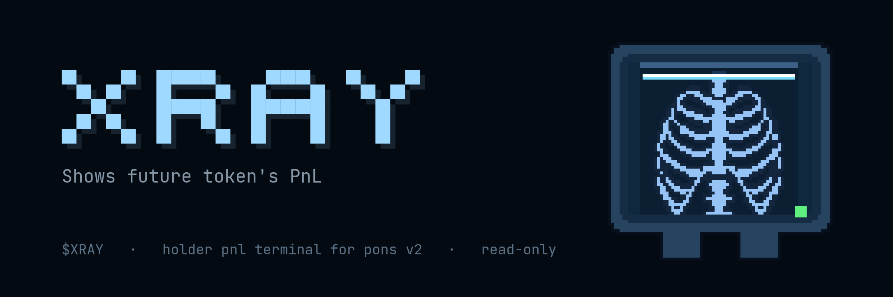
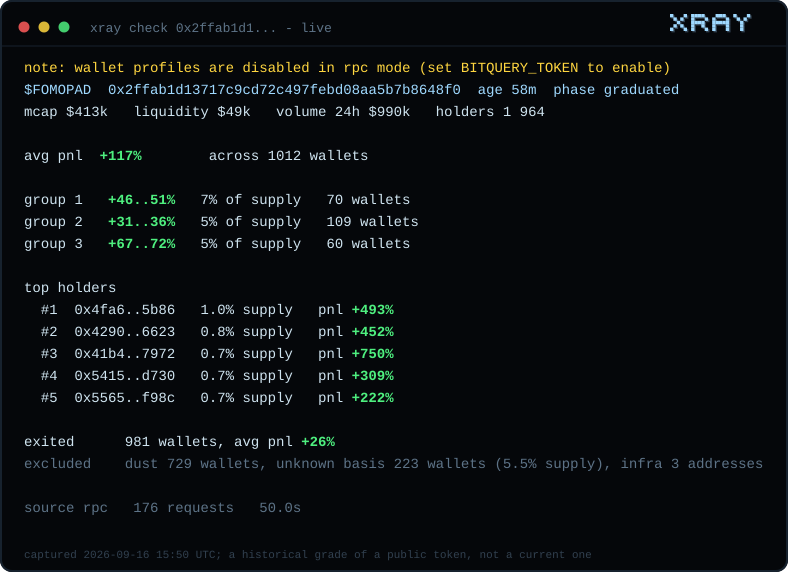
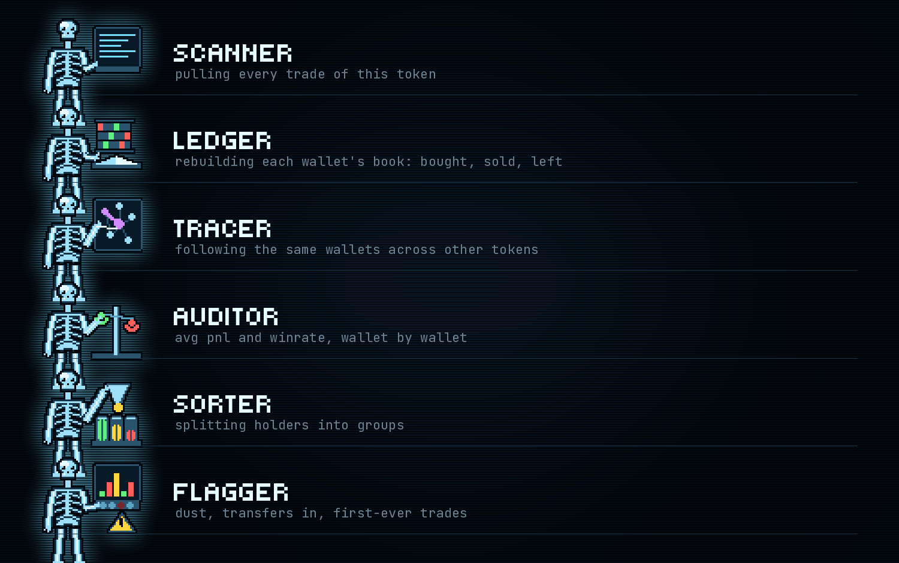
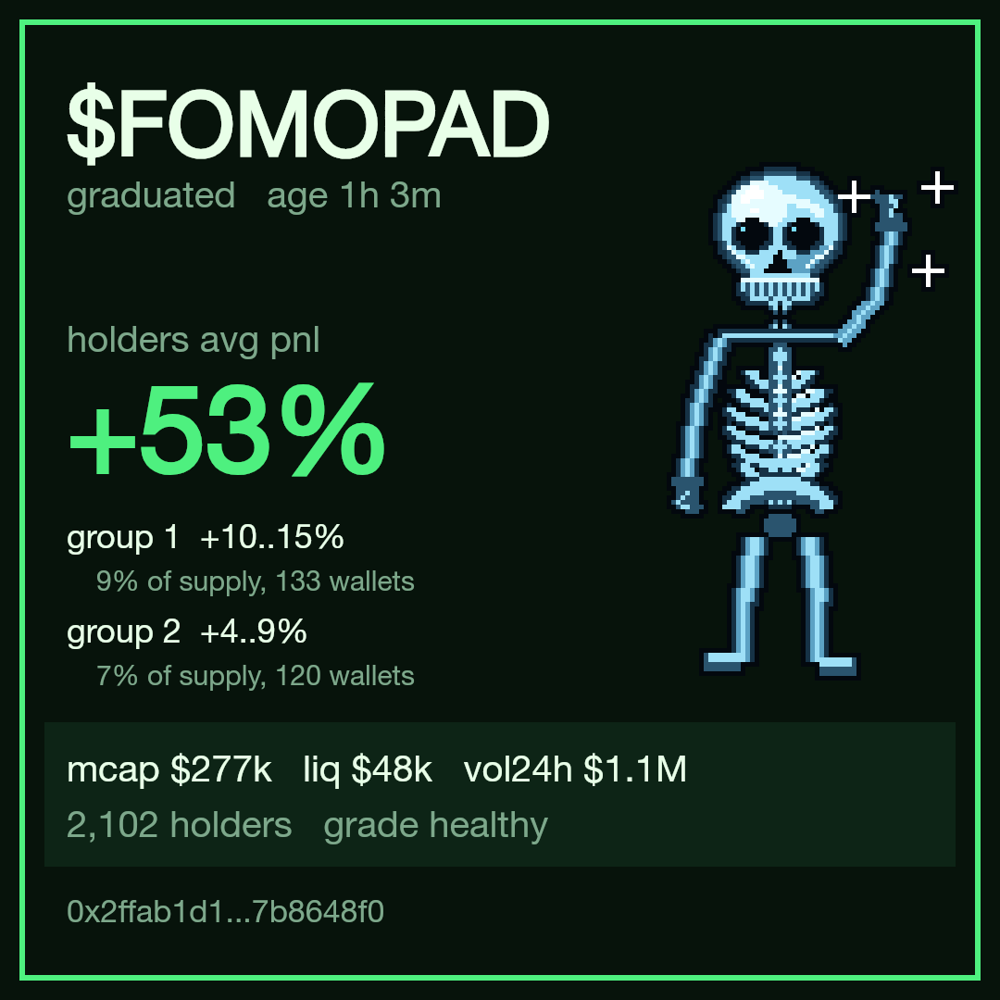
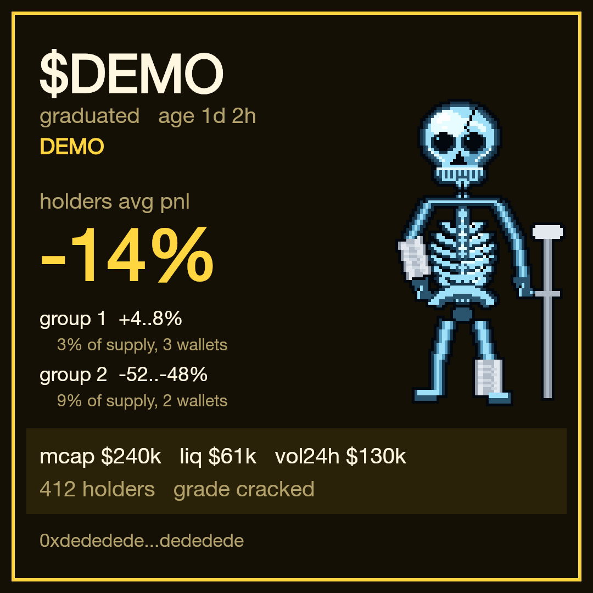
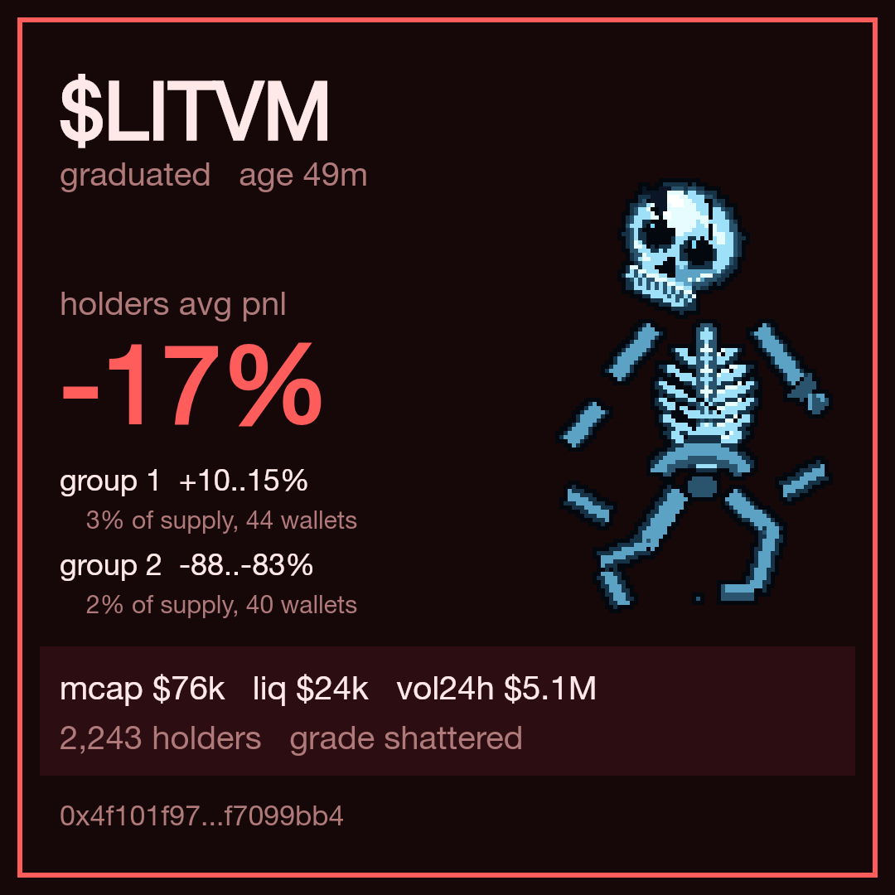
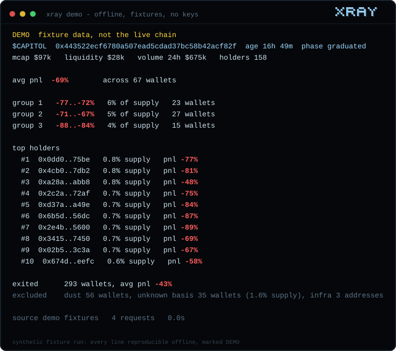
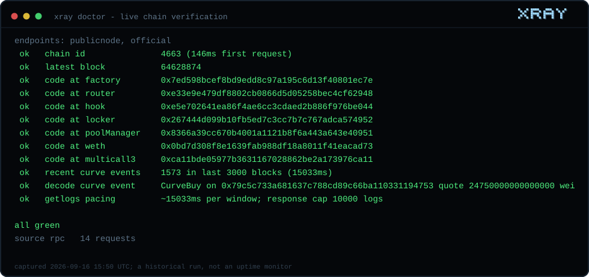

<p align="center"></p>

<p align="center">
  <a href="https://github.com/Skynet-inisghts/holder-pnl/actions/workflows/ci.yml"></a>
  
  
  
  
  <a href="LICENSE"></a>
</p>

<p align="center"><strong>The terminal that shows who is actually in profit in a token.</strong><br>A read-only CLI and library for holder PnL on Pons V2 tokens, Robinhood Chain.</p>

<p align="center"><a href="#start-in-one-minute">Start in one minute</a> · <a href="#how-it-reads-a-token">How it reads a token</a> · <a href="#grades">Grades</a> · <a href="#live-check">Live check</a> · <a href="#methodology">Methodology</a> · <a href="#boundaries">Boundaries</a></p>

## Why xray

A chart shows you a price. It does not show you who is trapped. Every Pons token is a room full of wallets. The only question that matters before you walk in is how the people already inside are doing: who is up, who is down, who already left and who is stuck holding a bag they cannot explain. xray takes a token address and reads the whole room: the PnL of every holder, the dense clusters they form, the average weighted by how much each of them actually holds.

### One command, the whole room



A captured run of `xray check` against the live chain, public RPC, no keys. The capture time is printed inside the image; it is a historical snapshot, not a current grade. [Captured output as JSON](assets/readme/check-snapshot.json)

## How it reads a token

<p align="center"></p>

Six agents, one per step of the pipeline. In the terminal they light up in the order the engine actually works, each one reporting its result when done - that row is the progress bar:

| | agent | what it does |
|---|---|---|
|  | **scanner** | pulling every trade of this token |
|  | **ledger** | rebuilding each wallet's book: bought, sold, left |
|  | **tracer** | following the same wallets across other tokens |
|  | **auditor** | avg pnl and winrate, wallet by wallet |
|  | **sorter** | splitting holders into groups |
|  | **flagger** | dust, transfers in, first-ever trades |

## Grades

The verdict is a skeleton. Three states of a holder base, thresholds in config, not hardcoded:

|  |  |  |
|:---:|:---:|:---:|
| **healthy** | **cracked** | **shattered** |
| avg pnl above zero and most holders in profit | mixed picture | most holders underwater, or the token is dead |

A token that fewer than 10 wallets still hold does not get averages at all - it gets the truth: `Token is dead. You're too early or too late`.

### Share cards

<p align="center">
  
  
  
</p>

Every check renders a 1080x1080 card with the grade skeleton next to the numbers. The green and red cards above are captured live runs of public tokens; the yellow one is a synthetic fixture and carries the DEMO plate, like everything synthetic here.

```bash
xray check 0x… --card card.png
```

## Start in one minute

```bash
git clone https://github.com/Skynet-inisghts/holder-pnl.git
cd holder-pnl
npm install
npm test              # 77 tests, offline, on bundled fixtures
npm run cli -- demo
```



`demo` runs the whole pipeline on a fixture snapshot bundled in the repo: no network, no keys, marked DEMO on the first line. Node 20+; runtime deps are `viem`, `commander`, `better-sqlite3` and `@napi-rs/canvas`.

### Check the sources



```bash
npm run cli -- doctor
```

The doctor verifies every hardcoded address and topic against the live chain instead of taking them on faith: chain id, bytecode at the factory, router, hook, locker, pool manager, WETH and multicall3, a real CurveBuy decoded from a recent block and the practical getLogs limits. A red line means numbers cannot be trusted yet.

## Live check

```bash
npm run cli -- check 0x…            # by contract address
npm run cli -- check TICKER         # by ticker; ambiguous tickers list the cluster
npm run cli -- check 0x… --format json --output out.json
npm run cli -- wallet 0x…           # wallet profile, full chain history
npm run cli -- index                # build the local chain-wide trade index
```

**One source: the public RPC.** No keys, no registration, no rate budget to buy. Phase 1 (holder PnL, groups, supply-weighted averages, header, cards) reads the token's own logs with adaptive windows: a 1,000-holder token computes in ~10-20s cold, repeats are near-instant from the incremental cache. Phase 2 (wallet profiles, badges, token winrate) reads the local trade index: the curve events name the real trader in their topics, so `xray index` backfills every curve trade on the chain into SQLite once, a cheap tail sync keeps it at the head and any wallet's full history is a local SELECT. Top-1000 profiles land in seconds at full depth. Post-graduation v4 swaps carry no trader topic and stay out of profiles - the curve is where meme life happens.

Tickers are not unique on Pons. When several launches share one, the CLI lists every candidate with its launch block and asks for the address. The first ticker query builds a launch index of the whole chain (minutes, half a million launches); later queries extend it incrementally (seconds).

## Methodology

- **PnL per token, not per wallet balance.** `pnl = sold_proceeds + value_now - bought_cost`, realized and unrealized in one number. An ETH top-up between trades cannot leak into it.
- **The trader is the token movement, never `tx.from`.** The transaction signer is almost always a relayer; buys and sells are detected by which side of the market the tokens crossed.
- **Averages are supply-weighted.** A wallet holding 5% of supply moves the token average five times harder than one holding 1%. Wallets that exited hold nothing, so they get their own line instead of steering the current picture.
- **Transfers break cost basis.** Tokens that arrived by transfer have no honest entry price; such wallets are flagged `unknown basis` and counted, never guessed. A microscopic cost basis (a few wei) is flagged the same way instead of printing astronomical percentages.
- **Opening tax is not part of cost basis**, so first-second buyers show inflated PnL - stated, not hidden.
- **Winrate is penalized on purpose:** `wins / (trades + 1)`. One virtual losing trade cuts a newcomer's percentage and dissolves for a veteran; below two closed trades the winrate is not shown at all.
- **Groups:** at most three per token, each no wider than 5 percentage points, chosen to maximize the share of supply inside.
- Dust (balance under $50) is hidden from the stats. Dollar figures use one keyless request to a public ETH/USD spot API; `ETH_USD=…` overrides it for fully offline runs.

The full spec lives in [docs/SPEC.md](docs/SPEC.md), the decisions on top of it in [docs/DESIGN.md](docs/DESIGN.md).

## Project map

```text
bin/xray.mjs             CLI: check, wallet, doctor, demo, serve
lib/
  chain.ts               chain constants, verified by doctor
  providers/             the source boundary: gate, adaptive logs, rpc
  read/                  token snapshot, header, launches, wallets
  pnl/                   pure math: classify, position, groups, aggregate
  profile/               winrate, badges, wallet profile
  grade.ts               healthy / cracked / shattered
  card.ts                1080x1080 share card with the grade skeleton
  cache.ts               SQLite: token ledger, launch index, 24h profile cache
  format.ts              text / json / markdown
assets/brand/            the art pack: sprites, fonts, generators (render_*.py)
assets/readme/           SVG views rendered from real command output (npm run render:readme)
test/                    node --test, offline, fixtures snapped from the live chain
.github/workflows/       ci.yml: typecheck, tests, no-signer
```

The math in `lib/pnl/` and `lib/profile/` is pure functions with no network access, tested on fixtures. Data sources sit behind one interface; everything above it cannot tell where the rows came from.

## Boundaries

- **Read-only, forever.** No keys, no signing, no transactions. A dedicated CI job greps the source for signing code on every commit and fails the build on a match.
- No external calls beyond the chain RPC and one keyless ETH/USD spot request (`ETH_USD` overrides it).
- `demo` runs offline and requires nothing.
- Synthetic output is always marked DEMO - fixtures are never passed off as the live chain.
- Exports refuse to overwrite existing files.

MIT.
